March 2, 2015

1.  [Systems of natural deduction](#deduc)
2.  [Rules for &and;](#and)
2.  [Rules for &or;](#or)
3.  [Rules for &not;](#not)
3.  [Rules for &perp;](#perp)
3.  [Reiteration](#reit)

# Systems of natural deduction

A system of natural deduction is the set of acceptable rules that can be used in constructing proofs. The proof rules can be used to specify all the *logical consequences* that are recognized by the logical language under investigation.

Different logical languages are associated with different systems of natural deduction based on:

+ The logical vocabulary of the language
+ The meanings that the semantic system assigns to the vocabulary of the language

Interestingly, there are lots of different ways to specify the system of natural deduction for a logical language. One way to do so would be to use truth tables to check every sentence of the language against every other sentence of the language and see if a logical consequence relation holds between them. Then we could add a rule to our system for every logical consequence relation we find. Of course, this process would be incredibly time consuming, and it wouldn't give us any understanding of *why* the logical consequence relations hold.

It turns out that we can specify the entire system of natural deduction for Boolean logic in a much more simple form. All we need is *two rules* for every connective of the language -- an **introduction** rule and an **elimination** rule.

+ Introduction rules tell us when it is appropriate to **add** a sentence involving the connective to a proof.
+ Elimination rules tell us how to appropriately deal with a sentence involving the connective that is **already in a proof**.

# Rules for &and;

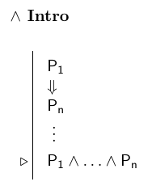
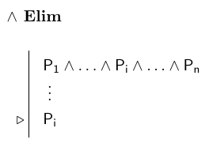

# Rules for &or;

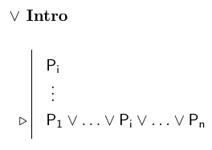

The or elimination rule requires us to introduce some new machinery into our proof construction operation. That machinery is the **subproof**. 

+ A subproof is a mini proof within a larger proof. 
+ A way to think about it intuitively is that we are putting the topic of the main proof on hold for a second and trying out a different line of reasoning for a bit. 
+ If our aside works out, then we can introduce the results back into the main proof (under certain constraints).

In Fitch, the subproof looks like this:
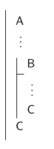

In a subproof, we:

+ Temporarily **assume** that a particular sentence is true.
+ Then we show that certain things follow from that assumption. 
+ At the end of the subproof we **discharge the assumption** and carry our results back into the main proof. 

With the notion of a subproof in hand, we can specify the elimination rule for &or;, which is a formal implementation of reasoning involving **proof by cases**.

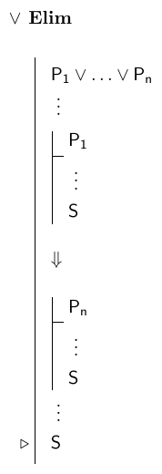

The subproofs represent different possible cases. Since S was found to be true in every possible case, we know that it is true no matter what. This allows us to *discharge the assumptions* and add S as a line in our main proof.

# Rules for &not;

We're already familiar with the elimination rule for &not;. We know it as **double negation**:

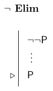

But for the &not; introduction rule, we need to introduce some new *vocabulary* into our language. We'll add one new word, &perp; (upside down T), which has a constant meaning -- it is false in all possible situations.

+ &perp; : false in all possible situations.

Since &perp; is always false, it can be used to represent any sentence that is a **contradiction**. And it turns out that contradictions can be very helpful in proof construction.

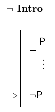

This rule is a formal implementation of reasoning involving **proof by contradiction**. Notice how the rule works. 

+ We make an assumption of *P* within a subproof, and we show that the assumption leads to a necessarily false conclusion (&perp;). 
+ Only contradictions can lead to contradictions, so this tells us that there was a problem with our original assumption of *P*.
+ This allows us to *discharge* the original assumption, and conclude that it's negation must be true.

# Rules for &perp;

We can think of &perp; as a zero-place connective. It takes zero sentences and outputs a false sentence. Since it is a connective, we need to add proof rules for how to deal with it to our system of natural deduction.

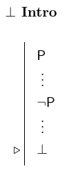
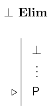

For the introduction rule, notice first that from P and &not;P we can infer (P &and; &not;P) using **&and; Intro**. But the truth table for a sentence of this form is:

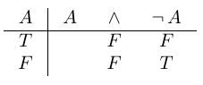

Since it is false in every row, we know that it is a contradiction. Also since it is false in every row, it is equivalent to &perp;, which is why it is acceptable to add &perp; to our proof whenever the proof already contains a sentence and its negation together.

The elimination rule is quite interesting. What it tells us is that we can infer **anything we please** from a contradiction. This is because:

+ A sentence (A) is a **logical consequence** of another sentence (B) just in case A is true in **every** situation in which B is true. 
+ Since &perp; is true in *no situations*, every sentence is a logical consequence of it by default. 
+ So, if our proof contains &perp; we know that any sentence we choose will be a logical consequence of it.
+ The trick, as we'll see, is to know what sentence to choose in order to make our proofs work out neatly.

# Reiteration

A subproof is some reasoning done on the side during a proof, so we should think of it as a self-contained packet of reasoning steps. That is why it is important to *discharge the assumption* of a subproof before returning back to the main proof. But, we can still make use of *prior* reasoning that was done in the main proof. The way we do that is by **reiterating** and earlier line of the proof later on.

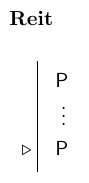

