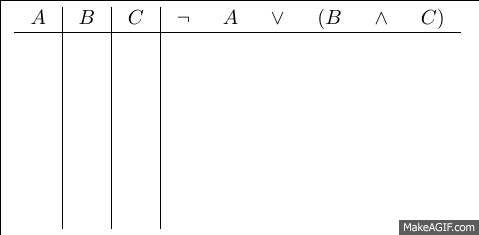

February 9, 2015

1.  [Expanded language](#expand)
    -   [Boolean connectives](#vocab)
    -   [Syntax of connectives](#syntax)
    -   [Truth conditions](#sem)
2.  [Recursion](#recur)
    -   [Structural ambiguity](#ambig)
    -   [Truth Tables for complex sentences](#complex)
3.  [Translation](#trans)
    -   [English representative](#eng)
    -   [Equivalent translations](#equiv)
    -   [Divergences from English](#diff)

Expanded Language
=================

Boolean Connectives 
-------------------

-   We will expand our language greatly just by adding three new bits of
    vocabulary
    -   our new words are known as the *Boolean connectives*

Vocab | Name  | English translation
:----:|:-----:|:-------------------
¬ | *not* | "it is not the case that ..."
∧ | *and* | "both ... and \_\_\_"
∨  | *or*  | "either ... or \_\_\_"

Syntax of connectives 
---------------------

-   The connectives work by taking one or more sentences and combining
    them into a single, larger sentence.
-   *not* is a *one place connective*, so it combines with one
    sentence to create another sentence.
    -   Ex: ¬ + Cube(a) = ¬Cube(a)
-   *and* and *or* are *two place connectives*, so they combine with two
    sentences to create another sentence.
    -   Tet(a) + ∧ + FrontOf(a,b) = Tet(a) ∧ FrontOf(a,b)
    -   Between(a,b,c) + ∨ + LeftOf(c,b) = Between(a,b,c) ∨ Leftof(c,b)
-   We thus end up with the following syntax rule for the Boolean connectives:

If *P* and *Q* are any sentences of FOL, then:

- *¬P* is a sentence of FOL,
- *P∧Q* is a sentence of FOL, and
- *P∨Q* is a sentence of FOL.

Truth conditions
----------------

-   The Boolean connectives are called "truth functional" connectives
    because their meaning depends exclusively on the truth values of the
    sentences they conbine with.
-   In FOL, we understand meaning entirely in terms of *truth
    conditions*.
    -   The truth conditions of a sentence are all the possible ways the
        sentence can vary in truth value.
    -   Since sentences involving Boolean connectives depend entirely on
        the truth value of the smaller sentences they combine with, the
        possible variation in truth value is limited by those sentences.
-   We can represent the truth conditions for a sentence by constructing
    a table that lists all the possibilities for that sentence: we call
    this a truth table.
    - In these tables, I let *P* and *Q* stand for any sentence of FOL. 

### Truth table for *not*

|P|¬P|
|:-:|:-:|
|T|F|
|F|T|

### Truth table for *and*

|P|Q|P ∧ Q|
|:-:|:-:|:---:|
|T|T|T|
|T|F|F|
|F|T|F|
|F|F|F|

### Truth table for *or*

|P|Q|P ∨ Q|
|:-:|:-:|:---:|
|T|T|T|
|T|F|T|
|F|T|T|
|F|F|F|

Recursion
=========

FOL has an interesting property that it inherits as a result of the syntax rule for the Boolean connectives; FOL is a **recursive** language. The idea behind recursion is that the syntax rule is *repeatable*. What this mean in practice is that bigger and bigger sentences can be built by repeating the rule over and over again.

Look again at the [syntax rule](#synrule) for the Boolean connectives. Notice that the initial condition says "if *P* and *Q* are **any sentence of FOL**. Well, the new sentences that we create using the connectives are *also* sentences of FOL, so that means that we can apply the same syntax rule to them as well. And then we could apply the rule again to the result, and so on indefinitely.

The syntax rule is like a machine that takes an input (a sentence) and spits out an output (a new sentence). Since the rule is recursive, we can take the output sentence, and feed it back into the rule.

As an example, we could start with the sentence *P*, and then apply the *not* part of the syntax rule to get *¬P*. Then we can take *¬P*, and apply the same rule again to get *¬¬P*. Then we can do it again to get *¬¬¬P*. Then we can ...

The upshot is that even though we've only added three new words to our language, because our syntax rule is recursive, we've actually expanded our language to make it possible to say an infinite number of sentences.

Structural ambiguity
--------------------

Since FOL is recursive, it is possible to create **complex** sentences such as the following (where A, B, and C can be any atomic sentence):

**¬A ∧ B ∨ C**

But when we try to ask what this sentence means, we run into a problem. The issue is that there isn't just *one* sentence there. Which sentence we have depends on what order we applied the rules in building up the sentence. So, sentences like the one above are *structurally ambiguous* between a couple of different sentences. To avoid this ambiguity, we introduce **parentheses** to indicate the order in which the sentence is supposed to be understood. Our one sentence above could mean any of the following:

+ **¬A ∧ (B ∨ C)**
+ **(¬A ∧ B) ∨ C**
+ **¬(A ∧ (B ∨ C))**
+ **¬((A ∧ B) ∨ C)**

Truth tables for complex sentences
----------------------------------

Once we've determined what complex sentence we have, we can determine what it means in the same way that we specified the meaning of sentences involving just one connective -- by using a truth table. In order to do this, we need a strategy for constructing truth tables for complex sentences.

<h4>Step 1: Construct the columns</h4>

+ Make a <em>column</em> for every distinct atomic sentence in the complex sentence, and label the column with a distinct variable (<em>A,B,C, ...</em>)
    - We call these **reference columns**
+ Add a column for the complete complex sentence

<h4>Step 2: Calculate the number of rows</h4>

+ Make a <em>row</em> for every distinct combination of truth values the atomic sentences can have
+ As a rule, if there are <em>n</em> atomic sentences, there will be <em>2n</em> combinations of truth values
    - If we have <em>A</em> and a <em>B</em>, there will be <strong>22 = 4</strong> rows in the table
    - If we have <em>C</em>, a <em>D</em>, and an <em>E</em>, there will be <strong>23 = 8</strong> rows in the table

<h4>Step 3: Fill the reference columns</h4>

+ Divide the number of rows in half. In the first reference column, fill the first half of the rows with <em>T</em>s, and the second half of the rows with <em>F</em>s
+ Divide the rows in half again. In the second reference column, fill the first quarter of the rows with <em>T</em>s, the second quarter with <em>F</em>s, and continue on, alternating every quarter.
+ Continue this process until the last reference has alternating <em>T</em>s and <em>F</em>s all the way down.

<h4>Step 4: Fill the rest of the table</h4>

+ Each connective in the complex sentence represents a new column.
+ Choose one of the connectives that connects only **atomic** sentences, and fill in the rows directly under it using the truth table for that connective and the truth values in the relevant reference columns.
    - Do the same thing for any other connectives that connect only atomic sentences.
+ Next, move on to connectives that connect larger sentences. Use the truth tables for that connective and the new truth values that you just entered to fill in the rows under that connective.
+ Continue this process until you have filled the rows under the connective that connects the largest sentences in the complex sentence. We call this the **primary**, or **main**, connective of the sentence.

<h4>Step 5: Step back and admire the meaning of your sentence!</h4> 

The column under the primary connective lists truth values that the complex sentence has in all the possible situations.  That is, it gives the *truth conditions* for that sentence.

#### Here is an example using ¬A ∨ (B ∧ C)

Translation 
===========

Above, we named the Boolean connectives after English words and gave them a translation into English. It was on the basis of these translations that we defined the truth tables for the connectives in the way that we did. However, the meaning of sentences involving these connectives in FOL can differ in subtle ways from the meaning of their English translations.

From English to FOL 
-------------------

+ In English, we'll often say things like:
    - "Mary is not hungry."
    - "John and Mary ate tacos."
    - "John ate beans or quinoa."
+ In these sentences, we use the connectives *not*, *and*, and *or* to connect *names* and *predicates*.

But FOL doesn't allow for this use of the connectives. We can only use them to connect *sentences*. So, we have to give these sentences a slightly modified translation.

+ "Mary is not hungry." ⇒ ¬Hungry(mary)
+ "John and Mary ate." ⇒ Ate(john,tacos) ∧ Ate(mary,tacos)
+ "John ate beans or quinoa." ⇒ Ate(john, beans) ∨ Ate(john, quinoa)

Equivalent translations
-----------------------

Because we can say more things in English than we can in FOL, there will be lots of instances in which we have to be clever in how we translate an English sentence into FOL. Sometimes different English sentences will receive the same FOL translation. 

And because FOL cares only about truth conditions when determining the meaning of sentences.  There will be some different sentences of FOL that end up having the same meaning. We will make use of this fact when we look at the logic of the Boolean connectives in the next chapter.

Divergences from English
------------------------

Even though the connectives are meant to be translations of English operators, we should keep in mind that FOL is a different language from English. There are some ways in which the meanings of the connectives in FOL differs from what we would take them to mean in English.

Consider the following two sentences:

+ "John and Mary got married and they had a baby."
+ "John and Mary had a baby and they got married."

While the first of these would probably only lead us to congratulate the happy couple, the second might make us wonder whether there was a shotgun involved in the wedding. This subtle difference in the meaning seems to come from the order of the sentences conjoined by *and*. When we see sentences like this in English, we assume that there is a causal or temporal order to the events it relates.

But in FOL, these sentences both mean the exact same thing. This is because *and* in FOL only cares about the *truth value* of the sentences it connects.  The order is irrelevant to meaning.

Next, imagine that we are out to dinner and after I order an entree, the server says:

+ "You can have soup or salad with that."

If I respond by saying "Yes," then the server will probably shoot me a sour look. That's because what she intended with this sentence is that I can have one or the other *but not both*. We call this use of *or* **exclusive or** because sentences involving it are false when both the sentences it connects are true.

But in FOL, my response would be perfectly acceptable. FOL treats *or* as **inclusive or**. This means that a sentence involving *or* is true if both of the sentences it connect (the *disjuncts*) are true. Check back at the [truth table for *or*](#ttor) to verify that this is the case.

