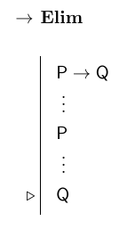
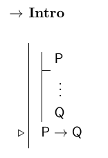
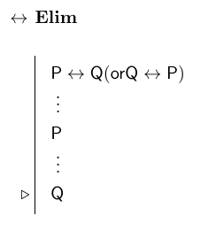
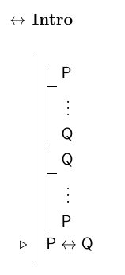
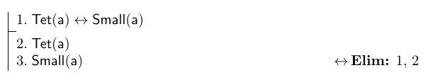
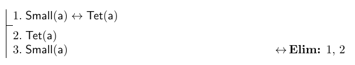

March 9 and 11, 2015

1.  [Expanding the language](#expand)
2.  [Truth conditions](#tc)
    -   [Truth tables for conditionals](#tc-cond)
    -   [Truth functional completeness of FOL](#complete)
2.  [Conditionals and logical inference](#inf)
2.  [Translation](#trans)
    -   [Weirdness in FOL](#weird)
    -   [Pragmatics](#prag)
2.  [Proof rules](#proofrules)
    -   [Rules for the conditional](#ifrules)
    -   [Rules for the biconditional](#iffrules)

Expanded Language
=================

Conditionals
------------

-   We will expand our language again by adding two new bits of vocabulary.

Vocab  | Name            | English translation
:-----:|:---------------:|:-------------------
&rarr; | *conditional*   | "if ... then \_\_\_"
&harr; | *biconditional* | "... if and only if \_\_\_"

-   The *conditional* and *bicondtional* are both *two place connectives*, so they combine with two sentences to create another sentence.
    -   "If a is a tetrahedron, then a is in front of b." = Tet(a) &rarr; FrontOf(a,b)
    -   a is between b and c if and only if c is left of b. = Between(a,b,c) &harr; Leftof(c,b)
-   We thus expand our syntax rule for the Boolean connectives thusly:

If *P* and *Q* are any sentences of FOL, then:

- &not;*P* is a sentence of FOL,
- *P* &and; *Q* is a sentence of FOL,
- *P* &or; *Q* is a sentence of FOL,
- *P* &rarr; *Q* is a sentence of FOL, and
- *P* &harr; *Q* is a sentence of FOL.

[Return to top](#top)

Truth conditions
----------------

-   The conditional and biconditional are also "truth functional" connectives: their meaning depends exclusively on the truth values of the sentences they combine with.
-   Their truth tables follow:

### Truth table for the conditional

| P | Q | P &rarr; Q |
|:-:|:-:|:----------:|
|T|T|T|
|T|F|F|
|F|T|T|
|F|F|T|

### Truth table for the biconditional

| P | Q | P &harr; Q |
|:-:|:-:|:----------:|
|T|T|T|
|T|F|F|
|F|T|F|
|F|F|T|

There are two important features of the truth table for the conditional that we should point out:

+ Notice that the 2nd and 3rd rows have different truth values, even though the only difference is that the truth values of P and Q have been switched.
  - This means that the conditional is **non-commutative**; that is, the *order* of the sentences it connects makes a difference to its truth value.
  - In order to keep the two sentences in a conditional straight, we call the first one the **antecedent** and the second one the **consequent**.
  - We'll look at an important case for which keeping the two sentences straight is important [below](#ifelim).
+ Notice that whenever the antecedent is *false*, the conditional as a whole is *true* (3rd and 4th lines).
  - This fact seems weird if we treat the conditional as a clear translation of "if ..., then \_\_\_". 
  - This is why we have to remember that we are using FOL, and it can differ from English in important ways.
  - We'll explore this weirdness of the conditional [below](#weird).

Truth functional completeness
-----------------------------

This addition of two new connectives into our language doesn't actually expand the *expressive power* of FOL. That is, everything we can say using the conditionals we could already say using just *negation*, *and*, and *or*. 

+ P &rarr; Q &hArr; &not;P &or; Q
+ P &harr; Q &hArr; (P &rarr; Q) &and; (Q &rarr; P) &hArr; (&not;P &or; Q) &and; (&not;Q &or; P)

You can construct a truth table to verify that each of these equivalences holds. In fact, we don't even need all three of the Boolean connectives.  We can construct sentences that are equivalent to all of the possible truth functions using just &not; and either &and; or &or;. Your textbook provides an interesting proof of this fact on pages 193-4.

So the addition of the conditional and biconditional doesn't actually expand our language at all. Instead, that value of the addition comes from two features:

+ Economy: while we can express all the sentences we need with just &not; and &or;, doing so leaves us with really long and difficult to understand sentences.  The addition of &and;, &rarr;, and &harr; allows us to greatly simplify the syntactic structures we're dealing with.
+ Application to proof methods. Just like we used &or; **Elim** to formally represent proof by cases and &not; **Intro** to formally represent proof by contradiction, we will use the conditionals to formally represent other methods of proof. The reason we can do this is explored in the next section.

[Return to top](#top)

# Conditionals and logical inference

Whether a sentence is *true* or not depends on what the world is like, and in different possible worlds a sentence will take different truth values. But some sentences, the **logical truths**, are true *no matter* what the world is like. These sentences are interesting because we can use them in proofs at any point.

There are certain logical truths involving the conditional and biconditional that will be useful to us in constructing proofs, so we introduce them here.

**Conditionals and logical consequence:** To say that a sentence C is a *logical consequence* of some sentences P1...Pn is just to say that C is true in every possibility in which all of P1...Pn are true. And we represent it in Fitch style as:

<table ><td class="step" >P1</td></table>

<table ><td class="step" >&#x205D;</td></table>

<table ><td class="step" >Pn</td></table>

<table ><td class="step" >C</td></table>

But given the meaning we assigned to the conditional and the conjunction operator, we can express the same idea by saying that:

+ (P1 &and; ... &and; Pn) &rarr; C is a *logical truth* 

This is because as long as C is not false when (P1 &and; ... &and; Pn) is true, the conditional above will be true. And if C *follows* from (P1 &and; ... &and; Pn), then it will *never* be false when the conjunction is true. We'll make use of this idea when we introduce conditional proof [below](#ifintro).

**Biconditionals and logical equivalence:** When two sentences are equivalent, they have the same truth values in every possibility. We have represented equivalence as:

+ A &hArr; B

But given the meaning we have assigned to the biconditional, we can express the same idea by saying that:

+ A &harr; B is a *logical truth*

This is because A &harr; B is true only when A and B have the same truth value. And if A &harr; B is *logically* true, then it is true in every possibility, which means that A and B have the same truth value in every possibility.

[Return to top](#top)

# Translation

The canonical English translation for P &rarr; A is "If P, then Q", but we also use the conditional to translate a number of other English sentences.

+ P &rarr; Q
  - If P, then Q.
  - Q, if P.
  - P only if Q.
  - Provided P, Q.
+ &not;P &rarr; Q
  - Unless P, Q.
  - Q unless P.

Since the order of the sentences in a conditional is significant, it is important to keep clear whether the antecedent or the consequent comes first in the various English translations.  Some of these translations won't be completely intuitive, so you may have to study them a bit to lock in the correct order of sentences in the translation.

## Weirdness in FOL

Consider the following two sentences:

1. If Malaysian Air Flight 370 didn't crash into the ocean, then it went missing for some other reason.
2. If Malaysian Air Flight 370 hadn't crashed into the ocean, then it would have gone missing for some other reason.

To my ear, sentence 1 sounds true: the plane is obviously missing, so if it didn't crash, something else happened to it. But sentence 2 seems false: it crashed, but if it *hadn't* then it would have landed safely in Beijing as scheduled.

Both sentences look like conditional statements, so we might be tempted to translate both of them as &not;Crash(malaysian) &rarr; Missing(malaysian). But this would be disasterous, because we would have one FOL sentence that is both true (because of 1) and false (because of 2).  This would make the conditional *non-truth-functional*. 

The solution that we take in this class is to not translate sentences like 2 using the material conditional. These sentences (with *have* and *would* in them) are sometimes called *subjunctive conditionals*, and their logic is more complicated than we can accurately capture with only truth-functional connectives.

Now consider the following sentence:

+ If Erik's hair is blond, then Robert Barchi is the President of Rutgers.

To most people, this sentence seems false, or maybe it doesn't have a truth value at all. But according to our truth table, the FOL translation, Blond(erik) &rarr; RutgersPresident(barchi) comes out true since it is false that Erik has blond hair.

People want to call the English sentence false because it doesn't seem that Erik's hair color has anything to do with who is President of the university. *If* statements seem to imply that there is a causal connection between the antecedent and the consequent, or at least that they are relevant to each other. 

Since the conditional in FOL is truth-functional, all that matters is the truth value of the connected sentences. Whether there is a causal connection between them is irrelevant to the truth of the conditional. We'll explore whether we can make sense of this in the next section.

## Pragmatics

When we utter sentences in conversation, we convey much more than just the meaning of the sentence. Certain factors about the manner in which we use a sentence can influence how someone interprets it. Because of this, linguists often add another component to the specification of a language.  In addition to the vocabulary, syntax, and semantics, we can try to provide a **pragmatics** for the language as well. This system tells us how the sentence would be interpreted in various contexts in which it might be used.

A primary tool in defining the pragmatics for a sentence is **conversational implicature**. This a meaning that seems to be *implied* by the sentence a person uses even though it isn't directly *said* by the person. A classic example of a conversational implicature is the following:

> Imagine that a professor writes a recommendation for a student, and all he writes is "This student has good handwriting and alsways showed up to class on time." From this recommendation, we would probably infer that the professor doesn't consider the student to be a very strong applicant. But even though this is a natural implication, we wouldn't say that the professor *said* that the student is a bad candidate.

A key test for whether an implication of a sentence is part of its *pragmatics* instead of its *semantics* is whether it can be **canceled** or not. In the example above, the professor could continue with "...but I don't mean that the student is a poor candidate." This suggests that the implication is only pragmatic. But it would sound weird for the professor to continue "...but I don't mean theat the student is punctual," because being punctual is part of the semantic meaning of what the professor said about the student.

**Some other interesting implicatures**

> If I am clearly in need of water when I meet you on the street and I ask you where I can get some, you might respond with "There is a QuickCheck just up the road". When I get there it is closed, and in my anger I track you down ask why you lied to me. You could rightly reply that you didn't *say* that the place would be open, so what you said was strictly true.

> If I go see Glili in the theater, and you ask me how it was, I might respond (in a highly exaggerated, affected voice) that "It was *wonderful*". If you pick up on my sarcasm, you would infer that I thought the movie stunk, even though that is the exact opposite of what I *said*. 

### Application to the conditional

We suggested that it might be part of the meaning of "If A, then B" that B is *caused* by A. But this would make *if* sentences non-truth-functional, and we couldn't use the material conditional to translate them.

An alternative way out is to say that the *meaning* of *if* sentences is just what the truth table for the material conditional says. The extra implication about there being a causal connection between the antecedent and the consequent is part of the *pragmatic* interpretation of *if* sentences in context.

If this idea is true, then we should be able to cancel the implication, as in:

> "If Erik has blond hair, then Robert Bachi is the President of Rutgers. But I don't mean that they are any way related. I just mean that either Erik *doesn't* have blond hair or Barchi is the President."

It's up for debate whether this makes sense as an explanation of the weirdness of the material conditional. But the key take away is that not everything we infer from a sentence has to be considered as part of its semantics. And for the rest of this class, we will treat *if* sentences as if their meaning is given perfectly by the truth table for the material conditional.

[Return to top](#top)

# Proof rules

Since the conditional and biconditional are truth functional connectives, we can explain how they are used in our system of natural deduction by defining introduction and elimination rules for each of them.

## Rules for &rarr;

**Conditional Elimination** also goes by the name of *modus ponens*, and it represents one of the most basic principles of human reasoning. It says that if we know that a conditional is true and we know that its antecedent is true, then we can conclude that the consequent is also true. Conditional elimination is invoked in the following example argument:

1. If it snowed 8 inches last night, then classes will be canceled today.
2. It snowed 8 inches last night.
3. Therefore, classes will be canceled today.

It is important to keep this valid argument form distinct from a superficially similar but invalid argument form. Consider:

1. If it snowed 8 inches last night, then classes will be canceled today.
2. Classes will be canceled today.
3. Therefore, it snowed 8 inches last night.

We can show that this argument is invalid by way of a counterexample. Imagine that it didn't snow at all last night, but there was a big lightning storm that knocked out power to all of New Brunswick. In this scenario, we can assume that classes will also be canceled, as they would have if it had snowed. Thus, both of our premises are true but the conclusion is false.

This argument form is known as *affirming the consequent* because the second premise states the consequent as true. It is invalid because it fails to consider that there might be *multiple* conditions that lead to the consequent. So even if the antecedent is false, the consequent may still be true for a different reason.

**Conditional Introduction** is our formal representation of *conditional proof* (or *proof by supposition*). It provides us with another *method* for constructing proofs, and it makes use of a subproof. The basic idea behind the rule is, if you assume the antecedent of a conditional and show that this assumption leads to the consequent, then you can *discharge the assumption* by entering the conditional as a whole into the main proof. An example of this sort of reasoning might look like this:

1. Ok, assume that it snowed 8 inches last night.
2. Then it wouldn't be safe to commute to campus on the Jersey highways.
3. Rutgers has a lot of commuters, and the university doesn't want to create an unsake situation.
4. So, in this scenario, they would cancel classes.
5. Therefore, *if* it snowed 8 inches last night, *then* classes will be canceled today.

On the basis of this argument, you might go check the weather report to see whether you should prepare to travel to class today.

# Rules for &harr;

The rules for the biconditional do not require any new resources for us to understand. They are just a little more complicated versions of the rules for the conditional.  THis makes sense because the biconditional is just a conditional that holds in **both directions**.

One thing to notice is the bit in parentheses in the &harr; **Elim** rule. This is just saying that if you have *either* of the biconditionals in your proof, you can use the rule.  That is, both of the following are correct uses of the rule:

