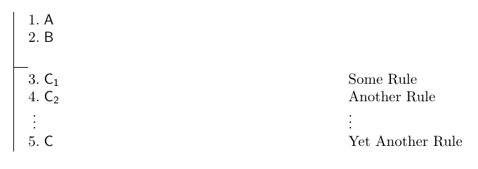
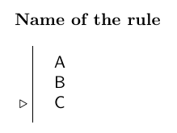
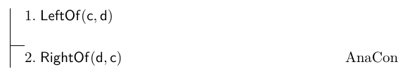
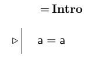
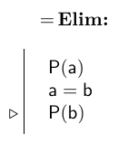

February 02 and 04, 2015

1.  [Reason and argument](#arg)
    -   [Example arguments](#ex)
2.  [Evaluating arguments](#eval)
    -   [Validity](#valid)
    -   [Soundness](#sound)
3.  [Logical consequence](#logical)
    -   [Proof](#proof)
    -   [Representing arguments](#fitch)
4.  [Proof rules for atomic sentences](#atomicrules)
    -   [Properties and relations of predicates](#predicates)
    -   [Analytical consequence](#anacon)
    -   [Identity](#identity)
5.  [Method of counterexample](#counter)

Reason and argument
===================

We are exploring the logical language of FOL as a way of investigating the nature of human reasoning. One way of understanding the notion of **reason** is as a process of moving in a rational way from one thought to another.

The primary tool of reaoning is the **argument**. The notion "argument" is understood in a lot of different ways, but in philosophy, we have a very particular understanding of what an argument is:

-   Arguments are:
    -   A set of **propositions** (also called *claims*, *statements*, or *sentences*)
    -   One of which is labeled the **conclusion**, the others **premises**
    -   The premises stand in a relation of **support** to the conclusion
-   Propositions are things that can be either *true* or *false*.
-   The support relation represents the idea that the premises provide a reason to believe the conclusion.

Example arguments
-----------------

### Argument 1

1.  If Tom Brady throws 6 touchdowns, then the Patriots win.
2.  Brady didn't throw 6 touchdowns in the Super Bowl.
3.  Therefore, the Patriots lost the Super Bowl.

This argument is clearly not a good one because the conclusion is false. But the premises seem to be true. (Imagine that every time Brady has thrown 6 TDs in the past, the Patriots have wone the game.) The problem
with this argument is that the premises don't actually *support* the conclusion.

### Argument 2

1.  Either Europa has life on it, or it is made of spearmint.
2.  Europa isn't made of spearmint.
3.  So, Europa has life on it.

This argument seems fishy because we shouldn't be able to agrue for something that we haven't yet checked out scientifically. But the reasoning here seems to be pretty good. It argues by \*process of elimination\* that the conclusion must be the true option. The problem is that we don't have any reason to believe that premise 1 is true.

### Argument 3

1.  All US Presidents have been men.
2.  Barack Obama is a man.
3.  It must be that Barack Obama is a US President.

Something has clearly gone wrong with this argument. But all of the propositions in it are true. The problem is that even though the conclusion is true, it isn't true *because of* the premises. So, the premises don't give us a good reason to believe the conclusion; in other words, they don't support the conclusion.

### Argument 4

1.  All humans are mortal.
2.  Barack Obama is a man.
3.  Thus, Barack Obama is mortal.

We've finally got a thoroughly good argument! The premises fully support the conclusion, and both of the premises are true. Thus, we know the conclusion must also be true.

Evaluating arguments
====================

The two key components of arguments are the *propositions* and the *support relation*. These give us two different ways of distinguishing good arguments from bad ones.

<table>
<col width="18%" />
<col width="13%" />
<col width="13%" />
<thead>
<tr class="header">
<th align="left"></th>
<th align="left">Good Support</th>
<th align="left">Bad Support</th>
</tr>
</thead>
<tbody>
<tr class="odd">
<td align="left">
True Conclusion
</td>
<td align="left">
Arg 4
</td>
<td align="left">
Arg 3
</td>
</tr>
<tr class="even">
<td align="left">
False Conclusion
</td>
<td align="left">
Arg 2
</td>
<td align="left">
Arg 1
</td>
</tr>
</tbody>
</table>

Validity
--------

The notion of "support" is still a little bit vague, so in logic, we define it precisely. And we call an argument in which the premises genuinely do support the premises **valid**.

-   An argument is valid if:
    -   if the premises are all true, then the conclusion *must be* true.

Thus, arguments 2 and 4, are valid arguments, while 1 and 3 are called *invalid*. Notice that even though argument 2 is valid, it still has a false conclusion. This is possible because validity cares only about the support relation; it doesn't by itself guarantee that the conclusion will be true.

Soundness
---------

Notice that the definition of validity above starts with a condition: "if the premises are all true". When we also consider the truth of the premises in evaluating an argument, we have another way of categorizing arguments. When an argument is valid and it has true premises we call it **sound**.

-   An argument is sound if:
    -   the argument is valid *and* all of the premises are true.

If an argument is sound, then we know that the conclusion has to be true.

Logical consequence
===================

Validity represents a *relation between sentences*. The idea is that if an argument is a good one, the truth of the conclusion is a *consequence* of the truth of the premises. We formalize this notion in our logical language with the notion of **logical consequence**.

-   A sentence (P) of FOL is a logical consequence some other sentences (Q,R,...) of FOL if:
    -   in all the possibilities in which *Q,R,...* are all true, *P* is also true.

Logical consequence is just a relation between sentences of FOL. We will make use of it to explain *reasoning* in a formal way.

Proof
-----

Sometimes it is obvious whether some sentence is a logical consequence of another sentence. For instance, if *FrontOf(a,b)* is true, then we know just by our understanding of English that *BackOf(b,a)* must be true. But sometimes, it is not at all obvious whether one sentence is a logical consequence of another or not.

*Reasoning* is a process of making clear all of the steps that a person undergoes in coming to believe a particular proposition. If the reasoning is clear, every step in the process will be an obvious consequence of the previous steps. In logic, we formalize this notion of reasoning by constructing **proofs**.

-   A proof is:
    -   A step by step process in which each step involves a *rule* of logical consequence.

The idea behind proofs is that they *show* the fact that one sentence is a logical consequence of others by listing a set of obvious logical consequences where the last member of the list is the sentence we are
trying to proove.

Fitch style
-----------

There are lots of different ways that we can represent proofs. In this class we use *Fitch* style.

-   In Fitch style:
    -   We draw a vertical line to the left of all the sentences in our proof.
    -   We then draw a short horizontal line to separate the premises of our proof (those sentences we are taking for granted) from all the various conclusions of our proof (those sentences which are shown to be logical consequences of previous sentences).
    -   Then we label each conclusion sentence that we add to our proof with the *rule* that the sentence is based on.

Each rule that we state on a line of our proof indicates that the sentence on that line is a logical consequence of the previous lines. The full set of acceptable rules that we can use in a proof constitutes the **system of deduction** for FOL. Our objective as the class proceeds is to learn and be able to use all the various acceptable rules of this system of deduction.

Proof rules for atomic sentences
================================

Proof rules are used to point out relations of logical consequence between specific kinds of sentences. When we define a proof rule, we will use the following format:

Proof rules allow us to add new sentences to our proof because they follow as logical consequences the previous sentences. The first lines of the proof rule tell us what sentences \*must already be present in
the proof\* in order to apply the rule. The sentence with triangle before it tells us what sentence it is acceptable to *add to the proof* on the basis of the rule.

So far, the only sentences we can say in our language are \*atomic sentences\*. The proof rules we define for our system of deduction will depend on what sentences we want to apply them to. So, our first set of proof rules will relate to atomic sentences.

Properties and relations of predicates
--------------------------------------

We've already got a means of talking about the properties and relations of *objects* on our domain.

-   *Cube(a)* says that *a* has the property of being a cube.
-   *FrontOf(b,c)* says that *b* stands in the relation of being in front of to *c*.

But we can also recognize that *predicates* can have certain properties or stand in certain relations. And we can use these properties and relations to establish logical consequence relations that hold between sentences that involve those predicates.

Not all properties of predicates are very interesting. For example, *Between(x,y,z)* has the property of being longer than 5 letters while *Cube(x)* lacks that property. But *being longer than 5 letters* isn't a very useful property for the purposes of logic. However, there are three particular properties of predicates that are interesting for logical
purposes: *being reflexive*, *being symmetric*, and *being transitive*.

To define these properties, I will use **variables** to stand for different predicates of FOL. For instance, I might write *P(x)* as a way of talking about any unary predicate; or I might write *Q(x,y)* as a way of talking about any binary predicate.

### Reflexive

Reflexivity has to do with whether a binary predicate holds of an object and *itself*.

-   *P(x,y)* is reflexive if:
    -   *P(a,a)* is true for *every* object in our domain.
-   An example of a reflexive predicate is *SameSize(x,y)* because no matter what object we are talking about we know that it is the same size as itself.
-   But *FrontOf(x,y)* is not reflexive because some objects are not in front of themselves. In fact, *no* object can be in front of itself, so we call this predicate *anti-reflexive*.

### Symmetric

Symmetricness has to do with whether a binary predicate holds "in both directions".

-   *P(x,y)* is symmetric if:
    -   Whenever *P(a,b)* is true, *P(b,a)* is also true.
-   An example of a symmetric predicate is *NextTo(x,y)* because if one object is next to another object, then the second object is also next to the first.

-   But *TallerThan(x,y)* is not symmetric because if *a* is taller than *b*, then *b* is not taller than *a*. In fact, *TallerThan(x,y) is *anti-symmetric*.

### Transitive

Transitivity has to do with whether a predicate *transfers* through a series of objects.

-   *P(x,y)* is transitive if:
    -   Whenever *P(a,b)* is true and *P(b,c)* is true, *P(a,c)* is also true.
-   An example of a transitive predicate is *BiggerThan(x,y)* because if we have a series of objects each of which is bigger than the previous one, then we know the last one is also bigger than the first one.
-   But *NextTo(x,y)* is not transitive because if *a* is next to *b*, and *b* is next to *c*, then *a* might not be next to *c* because they could be separated by *b*.

In addition to properties of predicates, we can also recognize special relations that can hold between predicates. An important such relation for logical purposes is *being inverses*.

### Inverse

Predicates that are inverses of each other in a sense express the same property, but viewed from different prespectives.

-   *P(x,y)* and *Q(x,y)* are inverses if:
    -   Whenever *P(a,b)* is true, *Q(b,a)* is true (and vice versa).
-   An example of predicates that are inverses are *LeftOf(x,y)* and *RightOf(x,y)*.
-   The spatial relations provide us with a wealth of various inverse relations.

### Bidirectionality of Between

The predicate *Between(x,y,z)* has unique property of its own. We already pointed out that the order of the second and third arguments of *Between(x,y,z)* doesn't make a difference to whether the sentence is true or not. Thus,

-   Whenever *Between(a,b,c)* is true, *Between(a,c,b)* is also true.

Analytical consequence
----------------------

The properties and relations that we just defined can be used to add new lines to proofs in a logical manner. However, notice that each of the properties are specific to the *meanings* of the predicates they apply to. *TallerThan(x,y)* is symmetric because of what it means for one thing to be taller than another. And *FrontOf(x,y)* and *BackOf(x,y)* are inverses because of what it means for one thing to be located in front of another thing.

Thus, these properties are relations are specific to the particular subject matter of our language. But one of the key features of logic is that it is supposed to be *topic neutral*, which means that the rules of logic apply no matter what subject we are concerned with.

Thus, it isn't quite right to call the rules based on properties and relations of predicates *logical* rules. Instead, we group them all under one heading and call them *analytical consequences*. Thus, if you want to apply one of these ideas within a proof, the proof rule that you cite is called *AnaCon*. Here's one example:

Here I used the fact that *LeftOf(x,y)* and *RightOf(x,y)* are inverses to add a new line to my proof, and the rule I cited is just the general rule of *AnaCon*.

The identity predicate
----------------------

There is one predicate of FOL that is often set aside as special. It is the *identity* predicate, which we represent in FOL as *x = y*. One reason that identity is special is that it has all three of the properties we just defined. And we can use those properties to establish our first proof rules.

-   This rule tells us that it is always acceptable at any point in a proof to add the sentence *a=a* (or *b=b*, etc). This is because the identity predicate is *reflexive*.

-   This rule tells us that if we know that *P(a)* is true, and we know that *a=b* is true, then we can add *P(b)* to our proof. Notice that in order to use this rule, the first two lines must already be in your proof somewhere.

-   This rule is based on the principle of \*the indiscernability of identicals*. The idea here is that if *a* and *b* are really names for the same object, then any predicate that holds of *a* must also hold of *b*.

Method of counterexample
========================

The proof procedure that we outlined above can be used to show that an argument is valid. As long as every line we add to our proof follows one of the proof rules we establish, then every sentence in the proof is a logical consequence of the previous sentences. But the proof method can't be used to show that an argument is *invalid*. For that, we need a
different tool. And the primary tool for showing that an argument is invalid is the **method of counterexample**.

Consider [Argument 3](#arg-3) from above. This argument is invalid even though it has all true premises and a true conclusion. If we wanted to explain why it is invalid, we would probably say something like, "it doesn't work because you can be a man without being President". We can make this idea precise by pointing out that there are lots of examples
of men who aren't president.

In essence, what we are doing here is imagining a scenario in which we substitute hypothetical individuals into the argument and showing that in that scenario, while the premises are all true, the conclusion comes out false. This hypothetical scenario that we imagined is a *counterexample* to the argument.

A counterexample shows that even if the premises are true, the conclusion *doesn't have to be* true; this is enough to show that the argument is invalid. We can use the Tarski's World program to implement the method of counterexample.

-   First, add all of the sentences of the argument (including the conclusion) on the sentences side of the program window.
-   Then create a new world with objects that the sentences refer to.
-   Use the truth checker and adjust the world so that all of the sentences *except the conclusion* come out true.
-   If you can do this, then your world represents a counterexample to the argument, and the argument is invalid.

