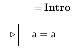

February 11, 2015

1.  [Possibility and Necessity](#poss)
2.  [Properties and relations of sentences](#sen)
    -   [Logical truth](#logical)
    -   [Equivalence](#equiv)
3.  [Properties and relations of the connectives](#conn)
    -   [Associativity](#assoc)
    -   [Commutativity](#com)
    -   [Idempotence](#idem)
4.  [Manipulating the Boolean connectives](#manip)
    -   [Normal forms](#normal)

Possibility and necessity
=========================

We understand the meaning of sentences in FOL in terms of their **truth conditions**, which is a characterization of the *truth value* that the sentence has in all *possible situations*. In order to understand this notion of meaning, we have to know what the possible situations are.

Intuitively, a "possibility" is just any way we can imagine the world being set up. But in practice, what counts as "possible" can vary depending on the circumstances. For instance, if we restrict our attention to situations in which we use the Rutgers bus system, then it seems right to say, "It's not possible to get from Livingston to Cook/Douglass in 20 minutes." But, if we consider situations in which we have jet packs, then it seems more accurate to say, "It *is* possible to get from Livingston to Cook/Douglass in 20 minutes." So, *possible* is senstitive to the set of situations we consider.

Since logic is topic neutral, we want to consider the most expansive set of situations. Thus, even though it's not *physically possible* to travel faster than the speed of light, it is *logically possible* to do so; the world of *Star Wars* is one such imaginable situation that shows the possibility.

So, we will understand meaning in FOL in terms of the following definitions:

-   A sentence is **possibly true** if it is true in *at least one* logically possible situation.
-   A sentence is **necessarily true** if it is true in *all* logically possible situations.

As we'll see below, even the notion of *locially possible* can have different meanings depending on what features of the logical system we are focusing on.

Properties and relations of sentences
=====================================

We've examined properties and relations of **names**, like *Cube(a)* and *LeftOf(c,d)*. And we've examined properties and relations of **predicates**, like *transitive* and *inverse*. We can also use the notion of possibility just defined to establish properties and relations of complete **sentences**.

-   If a sentence is true in all possible situations, then it is a **logical truth**.
-   If a sentence is false in all possible situations, then it is a **contradiction**.
-   If two sentences are true in all the same possible situations, then they are **equivalent**.

Logical truth
-------------

We can use logical truth, as a way to add new lines to a proof. If a sentence is a logical truth, then it is true *no matter what*. So, it is allowed to add it to a proof at any time. We've already seen an example of one of these rules:

But identity sentences aren't the only logical truths. Consider the sentence **Tet(c) ∨ ¬Tet(c)**. Sentences of this form are also logical truths, which we can check using a truth table (Here, I let **A** stand for any atomic sentence of FOL):

Notice that in every row, the truth value of the main connective it *true*. This, shows that the sentence is true in every possible situation.

Contrast this with the truth table for sentences of the form **A ∧ ¬A**, which shows that they are *contradictions*

### Kinds of logical truth

But now consider the sentence **¬(Larger(a,b) ∧ Larger(b,a))**. Is this a logical truth or not? First, let's check out the truth table:

According to this table, the sentence is not a logical truth because it is false in the situation represented by the first row. But now consider a variety of different possible worlds using the Tarski's world program:

These are all the (relevant) possible worlds that I can imagine for this sentence. But notice that the sentence is true in all of them. This suggests that it is a logical truth.

So, which method is correct? Actually, they both are, it's just that they use different notions of *possible situation*. If a sentence is necessarily true according to the truth table method, we call it a **tautology**. If it is necessarily true according to the Tarski's world method, we call it a **TW-logical truth**. In this case, ¬(Larger(a,b) ∧ Larger(b,a)) is a TW-logical truth, but not a tautology.

Equivalence
-----------

Equivalence is a relation between two sentences that holds when the sentences share the same truth value in every possible situation. We can check for equivalence using a truth table. As a simple example, let **A** be any atomic sentences of FOL, and compare it's truth table to **&not;&not;A**. This equivalence is known as *Double Negation*.

Another, more interesting example is the pair of equivalences known as *DeMorgan's Rules*, the truth tables for which are below:

Equivalences are useful because they give us a new way to add new lines to proofs. When two sentences are equivalent, we know that whatever truth value the one has, the other has the same. Thus, they can be **replaced** for eachother in a proof at any point without changing the logical consequence relations of the proof in any way. Thus, the following is an acceptable move in a proof, based on the DeMorgan's rules equivalence:

Notice that the justification in the previous partial proof is *Taut Con*. Just like *Ana Con*, *Taut Con* is really a large group of proof rules all rolled into one. All truth table equivalences like the double negation one and the DeMorgan's rules, are grouped together under the heading *Taut Con*. 

Not only can we add a sentence to a proof when an earlier line is a sentence that is equivalent to it, we can also add a new line in which we *insert* an equivalent sentence as a part of it. Once again, since the two sentences are equivalent, replacing one for the other never changes the meaning (truth conditions) of a sentence. Here is an example that makes use of the double negation equivalence.

Properties and relations of the connectives
===========================================

We can establish even more proof rules by considering properties and relations that hold of sentences involving the Boolean connectives. Three of the most important such relations are *associativity*, *commutativity*, and *idempotence*.

Associativity
-------------

The Boolean operators *and* and *or* only care about the truth values of the sentences they connect. So, they don't care about how those sentences are grouped together. That is, if you have a sentence that contains only *and* operators, or one that includes only *or* operators, you can **associate** the sentences any way you please.^[But be careful here. This equivalence only holds when the sentence has only one kind of operator in it. If the sentence has both *and* and *or* operators in it, then associativity fails. In this case, the relation we need is *distributivity*, which we'll examine later.] Formally, we write the equivalences like this:

**Associativity of &and; :** (A &and; B) &and; C &#x2194;  A &and; (B &and; C)

**Associativity of &or; :** (A &or; B) &or; C &#x2194;  A &or; (B &or; C)

Commutativity
-------------

The Boolean operators also don't care about the *order* that the sentences they connect come in. We formalize this property using the *commutativity* equivalence:

**Commutativity of &and; :** A &and; B &#x2194;  B &and; A

**Commutativity of &or; :** A &or; B &#x2194;  B &or; A

Idempotence
-----------

The Boolean operators also don't change the truth value of a sentence if you connect that sentence to itself. This property is similar to the property of *reflexivity* that holds of some predicates, but for the connectives we call it *idempotence*:

**Idempotence of &and; :** A &#x2194;  A &and; A

**Idempotence of &or; :** A &#x2194;  A &or; A

You can verify that all of these properties hold of the connectives by constructing a truth table for each of them.  As an example, here's a truth table to show that *and* is associative:

Since we have demonstrated that these two sentences are equivalent using a truth table, we are allowed to make use of the equivalence in a proof if we so desire. Thus, the following is an acceptable move in a proof:

# Manipulating the Boolean connectives

By exploring the properties and relations of the Boolean connectives, we have been able to establish certain equivalences between classes of sentences of FOL.

## Double negation

P &#x2194; &not;&not;P

## DeMorgan's rules

&not;(P &and; Q) &#x2194; &not;P &or; &not;Q
&not;(P &or; Q) &#x2194; &not;P &and; &not;Q

## Commutativity

P &and; Q &#x2194;  Q &and; P
P &or; Q &#x2194;  Q &or; P

## Associativity

(P &and; Q) &and; R &#x2194;  P &and; (Q &and; R)
(P &or; Q) &or; R &#x2194;  P &or; (Q &or; R)

## Idempotence

P &#x2194;  P &and; P
P &#x2194;  P &or; P

## Distributivity

P &and; (Q &or; R) &#x2194; (P &and; Q) &or; (P &and; R)
P &or; (Q &and; R) &#x2194; (P &or; Q) &and; (P &or; R)

# Normal forms

We can use these established equivalences to manipulate complex sentences of FOL by replacing one sentence for an equivalent one within the complex sentence. Manipulating sentences in this way can be helpful in making evident the logical structure of the sentence

+ **Negation normal form**: any negations in the sentence apply only to atomic sentences
    - We call a sentence that is either an atomic sentence or a negation of an atomic sentence a **literal**
+ **Disjunction normal form**: the sentence is a *disjunction* of one or more sentences each of which is a *conjunction* of one or more literals
    - Example: (B &and; C) &or; A &or; (D &and; &not; E &and; F)
+ **Conjunction normal form**: the sentence is a *conjunction* of one or more sentences each of which is a *disjunction* of one or more literals
    - Example: (A &or; C) &and; (D &or; &not; E)

## Example derivations

**(A &or; B) &and; C &and; (&not;(&not;B &and; &not;A) &or; B)**

         | (A &or; B) &and; C &and; (&not;(&not;B &and; &not;A) &or; B)                                      | Property           
:-------:|:--------------------------------------------------------------------------------------------------|:-----------
&#x2194; | (A &or; B) &and; C &and; ((&not;&not;B &or; &not;&not;A) &or; B) | DeM
&#x2194; | (A &or; B) &and; C &and; ((B &or; A) &or; B)                     | Double Neg
&#x2194; | (A &or; B) &and; C &and; (B &or; A &or; B)                       | Assoc
&#x2194; | (A &or; B) &and; C &and; (B &or; A)                              | Idem
&#x2194; | (A &or; B) &and; C &and; (A &or; B)                              | Comm
&#x2194; | (A &or; B) &and; C                                               | Idem

**A &or; &not;(B &or; &not;C &or; &not;A)** 

         | A &or; &not;(B &or; &not;C &or; &not;A)                                                       | Property           
:-------:|:----------------------------------------------------------------------------------------------|:-----------
&#x2194; | A &or; &not;(B &or; (&not;C &or; &not;A))                    | Assoc
&#x2194; | A &or; (&not;B &and; &not;(&not;C &or; &not;A))              | DeM
&#x2194; | A &or; (&not;B &and; (&not;&not;C &and; &not;&not;A))        | DeM
&#x2194; | A &or; (&not;B &and; (C &and; A))                            | Double Neg
&#x2194; | (A &or; &not;B) &and; (A &or; (C &and; A))                   | Dist
&#x2194; | (A &or; &not;B) &and; ((A &or; C) &and; (A &or; A))          | Dist
&#x2194; | (A &or; &not;B) &and; ((A &or; C) &and; A)                   | Idem
&#x2194; | (A &or; &not;B) &and; (A &or; C) &and; A                     | Assoc

