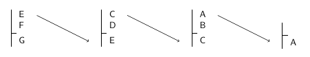

April 13, 20, and 22, 2015

1.  [Tautologies and quantifiaction](#taut)
    - [Truth-functional form algorithm](#tffa)
2.  [First order validity and consequence](#fovc)
    - [Tautological consequence](#tautcon)
    - [Analytical consequence](#anacon)
    - [First order consequence](#focon)
3.  [Quantifiers and Boolean connectives](#quantbool)
4.  [Axiomatic method](#axiom)

# Tautologies and quantification

Quantifiers and Boolean connectives are different kinds of expressions of our language, but they can interact in interesting ways within single sentences.

<h2><a name="tffa" href="./tffa.html">Truth functional form algorithm</a></h2>

<iframe width="600px;" height="500px;" src="./tffa.html"></iframe>

[Return to top](#top)

* * * * *

# First order validity and consequence

One of our main concerns in this class has been with the notion of **logical consequence**. We understand logical consequence in terms of *truth* across a range of *possibilities*, so in general, our definition of logical consequence is:

+ A is a **logical consequence** of B &Rarr; A is true in every possibility in which B is true

But, as we've seen, the notion of *possibility* is vague. In difference contexts we count different situations as genuine possibilities. For instance, in determining your class schedule for the semester, you may say, "I can't sign up for Phil 300 because it is on Cook campus, and it's not possible for me to get from Livingston to Cook in 20 minutes." In a context in which we are considering normal transportation options, we would count this sentence as true. But if we allow the possibility that you could use a jetpack to travel between campuses, then your statement no longer seems true.

## Kinds of expressions and possibility

One of the things that can change what possibilities we consider is the type of expression that we focus on in a sentence.  We have introduced three main types of expression into our language:

+ Predicates (and names)
+ Boolean connectives
+ Quantifiers

And each of these expression types is associated with a different form of logical consequence:

### Tautological consequence

When we consider just the meaning of the Boolean connectives in a sentence, we abstract away from the specific meaning of the predicates involved. Thus, if we have the argument:

<table ><td class="step" >&not;Adjoins(a,b)</td></table>

<table ><td class="step" >&not;Adjoins(b,c)</td></table>

<table ><td class="step" >&not;(Adjoins(a,b) &or; Adjoins(b,c))</td></table>

We can focus on the Boolean connectives by applying the **truth-functional form algorithm**, and we end up with:

<table ><td class="step" >&not;A</td></table>

<table ><td class="step" >&not;B</td></table>

<table ><td class="step" >&not;(A &or; B)</td></table>

And now it becomes clear that if we conjoin the two premises, we have an instance of DeMorgan's rules. Thus, the argument is valid.  And since it is valid **in virtue** of the Boolean connectives it contains, we call it a **tautological consequence**.

### Analytical consequence

But consider the following argument:

<table ><td class="step" >&not;Larger(a,b)</td></table>

<table ><td class="step" >&not;SameSize(a,b)</td></table>

<table ><td class="step" >Larger(b,a)</td></table>

If we put this argument into truth functional form, we end up with:

<table ><td class="step" >&not;A</td></table>

<table ><td class="step" >&not;B</td></table>

<table ><td class="step" >C</td></table>

In its truth functional form, this is not a valid argument, which we could show via a truth table. But the original argument seems to be a good one. How could b *not* be larger than a, given that a isn't larger, and they aren't the same size? Obviously, the conclusion does follow from the premises, but that's because the meaning of Larger and SameSize are doing some work. When we include those meanings, we only consider possibilities that we can represent using Tarski's World.  And in all those possibilities, the conclusion is true whenever the premises are.

We call consequences like this one, which aren't tautologically valid, but are valid in virtue of the meaning of the predicates, **analytical consequences**.

### First Order consequence

A similar situation applies to arguments that involve quanlfied sentences. We may have arguments that are not tautologically valid, but become valid when we consider the meaning of the quantifiers involved in them.  Consider the following argument (**Exercise 10.17 in your book**):

<table ><td class="step" >&forall;x Cube(x)</td></table>

<table ><td class="step" >Cube(b)</td></table>

In truth-functional form, this becomes:

<table ><td class="step" >A</td></table>

<table ><td class="step" >B</td></table>

which is clearly not valid. But if we don't abstract away from the specifics of the premise, it seems that the conclusion can't fail to be true whenever the premise is.  This is because the meaning of the universal quantifier (&forall;) does some work in the argument. If everything is a cube, then in particular, b is a cube. But notice that there's nothing specific to *cubes* that makes this consequence hold. We would get the same result if we considered shoes, or ships, or sealing wax. 

Thus, we can distinguish a third kind of logical consequence, one that depends specifically on the meaning of the quantifiers. We call this form of logical consequence **first order consequence**.

To distinguish first order consequence from analytic consequence, we want to **abstract** away from the meaning of the predicates invovled in our sentences, so that we can focus on the quantifiers. To do this, we **replace** each predicate with **any** other predicate of the same arity. By replacing in this way, we take out the role that the particular predicates are playing in the argument. So, for instance, our example argument above has the same **replacement form** as:

<table ><td class="step" >&forall;x Banana(x)</td></table>

<table ><td class="step" >Banana(b)</td></table>

And the validity of the argument doesn't change. This suggests that it's validity is due to the quantifer as opposed to the predicate *Cube*.  But consider:

<table ><td class="step" >&forall;x (Dodec(x) &rarr; &not;SameCol(x,c))</td></table>

<table ><td class="step" >&not;Dodec(c)</td></table>

The premise of this argument says that everything that is a dodec is not in the same column as c. But since c is in the same column as c, it follows that c can't be a dodec.  Thus, this argument is valid. But look what happens if we switch out the predicates for different, random ones.

<table ><td class="step" >&forall;x (Cube(x) &rarr; &not;BackOf(x,c))</td></table>

<table ><td class="step" >&not;Cube(c)</td></table>

This replaced version is not valid. Here is a counterexample world that demonstrates this:

<table class="worldtable" ><tr ><td class="twcell twblack" title="" ></td><td class="twcell twwhite" title="" ></td><td class="twcell twblack" title="" ></td><td class="twcell twwhite" title="" ></td><td class="twcell twblack" title="" ></td><td class="twcell twwhite" title="" ></td><td class="twcell twblack" title="" ></td><td class="twcell twwhite" title="" ></td></tr><tr ><td class="twcell twwhite" title="" ></td><td class="twcell twblack" title="" ></td><td class="twcell twwhite" title="" ></td><td class="twcell twblack" title="" ></td><td class="twcell twwhite" title="" ></td><td class="twcell twblack" title="" ></td><td class="twcell twwhite" title="" ></td><td class="twcell twblack" title="" ></td></tr><tr ><td class="twcell twblack" title="" ></td><td class="twcell twwhite" title="" ></td><td class="twcell twblack" title="" ></td><td class="twcell twwhite" title="" ></td><td class="twcell twblack" title="" ></td><td class="twcell twwhite" title="" ></td><td class="twcell twblack" title="" ></td><td class="twcell twwhite" title="" ></td></tr><tr ><td class="twcell twwhite" title="" ></td><td class="twcell twblack" title="" ></td><td class="twcell twwhite twmedium  twdodecahedron" title="A medium  dodecahedron named a." >a</td><td class="twcell twblack" title="" ></td><td class="twcell twwhite" title="" ></td><td class="twcell twblack" title="" ></td><td class="twcell twwhite" title="" ></td><td class="twcell twblack" title="" ></td></tr><tr ><td class="twcell twblack" title="" ></td><td class="twcell twwhite" title="" ></td><td class="twcell twblack" title="" ></td><td class="twcell twwhite" title="" ></td><td class="twcell twblack" title="" ></td><td class="twcell twwhite twmedium  twtetrahedron" title="A medium  tetrahedron named b." >b</td><td class="twcell twblack" title="" ></td><td class="twcell twwhite" title="" ></td></tr><tr ><td class="twcell twwhite" title="" ></td><td class="twcell twblack" title="" ></td><td class="twcell twwhite" title="" ></td><td class="twcell twblack" title="" ></td><td class="twcell twwhite" title="" ></td><td class="twcell twblack" title="" ></td><td class="twcell twwhite" title="" ></td><td class="twcell twblack" title="" ></td></tr><tr ><td class="twcell twblack" title="" ></td><td class="twcell twwhite" title="" ></td><td class="twcell twblack" title="" ></td><td class="twcell twwhite twmedium  twcube" title="A medium  cube named c." >c</td><td class="twcell twblack" title="" ></td><td class="twcell twwhite" title="" ></td><td class="twcell twblack" title="" ></td><td class="twcell twwhite" title="" ></td></tr><tr ><td class="twcell twwhite" title="" ></td><td class="twcell twblack" title="" ></td><td class="twcell twwhite" title="" ></td><td class="twcell twblack" title="" ></td><td class="twcell twwhite" title="" ></td><td class="twcell twblack" title="" ></td><td class="twcell twwhite" title="" ></td><td class="twcell twblack" title="" ></td></tr></table>

So, this argument is not a tautological consequence or a first order consequence. It is valid, but its validity depends crucially on the meaning of the predicate *SameSize*. Thus, this is an analytical consequence.

## Why this all matters

Our goal in this class is to investigate in a formal way different forms of human reasoning. One of the primary tools we have as reasoners is our ability to detect valid arguments. But our language shows us that lots of different things can go into our judgement that an argument is valid. Specifying these different forms of logical consequence allows us to determine whether we judge an argument to be valid because of its Boolean form, it's first order form, or because of the meaning of the predicates it invokes.

For additional practice on the different kinds of logical consequence, you should examine exercises 10.10-10.19 in the book.

[Return to top](#top)

* * * * *

# The interaction of quantifiers with Boolean connectives

Quantifiers can combine with the Boolean connectives in interesting ways, and the different combinations can give rise to subtle variations in the logical consequence relation.

Consider the following logical equivalence:

+ &not;(&exist;x Cube(x) &and; &forall;y Dodec(y)) &hArr; &not;&exist;x Cube(x) &or; &not;&forall;y Dodec(y)

This equivalence is **tautological**, as can be seen from its truth-functional form:

+ &not;(&exist;x Cube(x)A &and; &forall;y Dodec(y)B) &hArr; &not;&exist;x Cube(x)A &or; &not;&forall;y Dodec(y)B
+ &not;(A &and; B) &hArr; &not;A &or; &not;B

But compare this to the following:

+ &forall;x (Cube(x) &rarr; Small(x)) &#8654; &forall;x (&not;Small(x) &rarr; &not;Cube(x))

This equivalence is **not** tautological, since:

+ &forall;x (Cube(x) &rarr; Small(x))A &#8654; &forall;x (&not;Small(x) &rarr; &not;Cube(x))B
+ A &#8654; B

Instead, the equivalence is due in some way to the quantifiers, but we can't just bypass the entirely.  Consider:

+ Cube(x) &rarr; Small(x) &#8654; &not;Small(x) &rarr; &not;Cube(x)

This is not an equivalence because equivalence requires the same truth values, and wffs that contain unbound variables don't have truth values.

But imagine that our *domain of discourse* includes just *a*, *b*, and *c*. Then:

+ Cube(a) &rarr; Small(a) &hArr; &not;Small(a) &rarr; &not;Cube(a)
+ Cube(b) &rarr; Small(b) &hArr; &not;Small(b) &rarr; &not;Cube(b)
+ Cube(c) &rarr; Small(c) &hArr; &not;Small(c) &rarr; &not;Cube(c)

In other words, the two wffs give rise to the same truth value no matter what object we substitute in for the variable. This is a way of understanding what it means for two wffs to be equivalent. Based on this, we can define a new notion of **substitution of equivalents**:

+ Let P and Q be *wffs*, and let S(X) be any sentence with X as a part, then:
  - if P &hArr; Q, then S(P) &hArr; S(Q) 

The upshot is that we can substitute equivalent wffs **within** quantified sentences free of charge, so long as we keep our substitutions consistent.

## DeMorgan's rules for quantifiers

The quantifiers have some interesting similarities to the Boolean connectives.  In particular:

+ &forall;x Cube(x) &#8621; Cube(a) &and; Cube(b) &and; Cube(c) &and; ...
+ &exist;x Cube(x) &#8621; Cube(a) &or; Cube(b) &or; Cube(c) &or; ...

The DeMorgan's rules for quantifiers are based on this similarity:

Just as:

+ &not;(A &and; B) &hArr; &not;A &or; &not;B
+ &not;(A &or; B) &hArr; &not;A &and; &not;B

So, too:

+ &not;&forall;x P(x) &hArr; &exist;x &not;P(x)
+ &not;&exist;x P(x) &hArr; &forall;x &not;P(x)

### An example

 &forall;x (P(x) &rarr; &not;Q(x)) | &hArr; | &forall;x (&not;P(x) &or; &not;Q(x))
:---------------------------------:|:------:|:------------------------------------:
                                   | &hArr; | &forall;x &not;(P(x) &and; Q(x))
                                   | &hArr; | &not;&exist;x (P(x) &and; Q(x))

### Distribution

&forall; distributes across &and;

+ &forall;x (P(x) &and; Q(x)) &hArr; &forall;x P(x) &and; &forall;x Q(x)

&exist; distributes across &or;

+ &exist;x (P(x) &or; Q(x)) &hArr; &exist;x P(x) &or; &exist;x Q(x)

But distribution fails if we swap the quantifiers

+ &forall;x (P(x) &or; Q(x)) &#8654; &forall;x P(x) &or; &forall;x Q(x)

**Counterexample:** Let P stand for *dog* and Q stand for *cat*, and imagine a world with one dog and one cat, and nothing else. In this world, the left sentence above is true, but the right one is false.

+ &exist;x (P(x) &and; Q(x)) &hArr; &exist;x P(x) &and; &exist;x Q(x)

**Counterexample:** Left as an exercise for the student.

[Return to top](#top)

* * * * *

# The axiomatic method

In this class, we've been exploring the **logical consequence** relation, but what we've ended up with is 3 different relations (tautological, first order, and analytical), each of which depends in part on the logic of the vocabulary involved in the sentences. But when we reflect on our own natural reasoning, we probably don't think of ourselves as switching back and forth between different logical consequence relations as we go along. So, it would be nice if we could unify our consequence relations.

**Goal:** Expand the scope of first order logical consequence to bring it more into line with analytical consequence.

**Method:** Add additional *logical truths* to our system of first order logic to represent the **Ana Con** rules we've investigated.

## Proof rules and logical truths

Most of our attention in our practice with proofs has been on the question of when it is appropriate to add a new line to a proof; that is, we've established rules that tell us when one sentence **follows from** some other sentences. But we've been less concerned with where we came up with the original sentences of our proof; that is, why should we think that the **premises** are true to begin with? 

Given the tools at our disposal, if we wanted to answer that question, all we could do would be to form a new argument with the original premise as its conclusion, and show that it follows from other premises. But then we may ask what our support for those *new* premises is. We would then form a argument, with new premises. But then we would ask for support for *those* premises. And so on.

But this process can't go on for ever. Eventually, we'll either run out of patience, or hit a point where we have some premises for which we can't give any further support. They are simply sentences that we believe to be true without any support. These sentences are **foundational** in our belief system; we know them to be true *independently* of any other beliefs we may have. We call sentences of this sort **axioms**.

We can visualize this notion of a logical system of beliefs as an upside down pyramid. The axioms form the foundation on which all other propositions rest. The levels of the pyramid represent the logical consequence relation of our system of logic.

But just because we can't give an argument using proof rules for axioms doesn't mean that we have *no* reason to take them to be logical truths. Instead, we can use our understanding of the nature of the world we are investigating to determine what sentences count as axioms of our language.

## The universe of the blocks language

In the blocks language, we examine  **spatial relations** betwteen **shapes** of different **sizes**. And we know just from what it is to have a particular shape or a particular size, that no block can have two different shapes or be two different sizes. And we know this without even examining a particular world, or knowing what specific block we are talking about. That is to say:

+ &not;&exist;x (Cube(x) &and; Tet(x))
+ &not;&exist;x (Tet(x) &and; Dodec(x))
+ &not;&exist;x (Dodec(x) &and; Cube(x))

Are all guaranteed to be true simply on the basis of the meaning of the shape predicates involved. And,

+ &not;&exist;x (Small(x) &and; Medium(x))
+ &not;&exist;x (Medium(x) &and; Large(x))
+ &not;&exist;x (Large(x) &and; Small(x))

Are all guaranteed to be true simply on the basis of the meaning of the size predicates involved. These sentences are not *tautological truths*, but they are logical truths. Because the acquire their status of logical truth from the meaning of the predicates involved, we call them **meaning postulates**.

But the limits of the universe we investigate in Tarski's world allows us to say some other things for certain. In particular, we know that Tet, Cube, and Dodec are the *only possible* shapes, and Small, Medium, and Large are the *only possible* sizes. Thus,

+ &forall;x (Tet(x) &or; Cube(x) &or; Dodec(x))
+ &forall;x (Small(x) &or; Medium(x) &or; Large(x))

These sentences are also logical truths, but they are also a bit different from the previous ones. It isn't part of the *meaning* of the predicates that these are the only shapes. Other shapes are certainly *possible*, they just don't occur in the universe that we are considering. And we can imagine having Tiny or Huge blocks; there just aren't any the Tarski's world universe. So these logical truths acquire their status from a **presupposition of the range of circumstances** of the universe under consideration.

## Converting invalid arguments

Since the axioms above are logical truths, we know they are true no matter what. That means we can add them to a proof at any point. Thus, we use axioms as a way of converting proofs that are not first order valid into ones that are. Consider:

<table ><td class="step" >&not;&exist;x Tet(x)</td></table>

<table ><td class="step" >&forall;x (Cube(x) &harr; &not;Dodec(x))</td></table>

If we reason through it intuitively, we can see that this argument is valid. The premise says that there are no tetrahedorns. This means that everything must be either a cube or a dodecahedron. And since nothing can be both, then everything is a cube if and only if it's not a dodecahedron. But, if we put the argument in truth functional form, it is not tautologically valid.

<table ><td class="step" >&not;&exist;x Tet(x)A</td></table>

<table ><td class="step" >&forall;x (Cube(x) &harr; &not;Dodec(x))B</td></table>

<table ><td class="step" >&not;A</td></table>

<table ><td class="step" >B</td></table>

Nor is the argument first order valid, which we can see by replacing the predicates with random substitutes:

<table ><td class="step" >&not;&exist;x Dog(x)</td></table>

<table ><td class="step" >&forall;x (Cat(x) &harr; &not;Mouse(x))</td></table>

Clearly, just because there are no dogs in the world doesn't mean there can't be any birds or fish around. So, not everything will be a cat if and only if it's not a mouse. But, if we expand the argument by adding additional premises, then we can make it so that the conclusion does indeed follow from the premises.

<table ><td class="step" >&not;&exist;x Tet(x)</td></table>

<table ><td class="step" >&forall;x (Tet(x) &or; Cube(x) &or; Dodec(x))</td></table>

<table ><td class="step" >&not;&exist;x (Dodec(x) &and; Cube(x))</td></table>

<table ><td class="step" >&forall;x (Cube(x) &harr; &not;Dodec(x))</td></table>

The added premises restrict the possible worlds that we can consider, and in this case, all the worlds in which the premises are true the conclusion is also true. We might be able to see this more easily by substituting in the same random predicates as above.

<table ><td class="step" >&not;&exist;x Dog(x)</td></table>

<table ><td class="step" >&forall;x (Dog(x) &or; Cat(x) &or; Mouse(x))</td></table>

<table ><td class="step" >&not;&exist;x (Dog(x) &and; Mouse(x))</td></table>

<table ><td class="step" >&forall;x (Dog(x) &harr; &not;Mouse(x))</td></table>

When we restrict what animals can exist in the world as the second premise does, we see that the conclusion does indeed follow.

