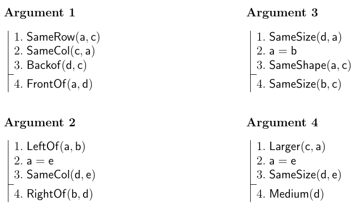

February 16 and 18, 2015

1.  [Atomic sentences](#atomic)
    - [Example arguments](#arg)
    - [Answers](#ans)
2.  [Sentences with Boolean connectives](#boole)
    - [Example truth tables](#tt)

# Atomic stentences

## Example arguments

For each of the arguments below, if the argument is valid, construct a proof showing that the conclusion is a logical consequence of the premises. If the argument is invalid, construct a world that is a counterexample to the argument. Example answers are provided below.

* * * * *

## Answers

### Argument 1

This argument is valid. A proof that the conclusion is a logical consequence of the premises follows: 

<a href='#' onclick="return false;">Click to show proof</a>

<table ><td class="step" >1. SameRow(a,c)</td><td class="ruleStep" ></td></table>

<table ><td class="step" >2. SameCol(c,a)</td><td class="ruleStep" ></td></table>

<table ><td class="step" >3. BackOf(d,c)</td><td class="ruleStep" ></td></table>

<table ><td class="step" >4. a = c</td><td class="ruleStep" >Ana Con&#160; : 1, 2</td></table>

<table ><td class="step" >5. BackOf(d,a)</td><td class="ruleStep" >= Elim&#160; : 3, 4</td></table>

<table ><td class="step" >6. FrontOf(a,d)</td><td class="ruleStep" >Ana Con&#160; : 5</td></table>

### Argument 2

This argument is valid. A proof that the conclusion is a logical consequence of the premises follows: 

<a href='#' onclick="return false;">Click to show proof</a>

<table ><td class="step" >1. LeftOf(a,b)</td><td class="ruleStep" ></td></table>

<table ><td class="step" >2. a = e</td><td class="ruleStep" ></td></table>

<table ><td class="step" >3. SameCol(d,e)</td><td class="ruleStep" ></td></table>

<table ><td class="step" >4. LeftOf(e,b)</td><td class="ruleStep" >= Elim&#160; : 1, 2</td></table>

<table ><td class="step" >5. LeftOf(d,b)</td><td class="ruleStep" >Ana Con&#160; : 3, 4</td></table>

<table ><td class="step" >6. RightOf(b,d)</td><td class="ruleStep" >Ana Con&#160; : 5</td></table>

Many arguments can be proved in different ways. An alternative proof of argument 2 is: 

<table ><td class="step" >1. LeftOf(a,b)</td><td class="ruleStep" ></td></table>

<table ><td class="step" >2. a = e</td><td class="ruleStep" ></td></table>

<table ><td class="step" >3. SameCol(d,e)</td><td class="ruleStep" ></td></table>

<table ><td class="step" >4. RightOf(b,a)</td><td class="ruleStep" >Ana Con&#160; : 1</td></table>

<table ><td class="step" >5. RightOf(b,e)</td><td class="ruleStep" >= Elim&#160; : 4, 2</td></table>

<table ><td class="step" >6. RightOf(b,d)</td><td class="ruleStep" >Ana Con&#160; : 5, 3</td></table>

### Argument 3

This argument is invalid. A counterexample world follows: 

<a href='#' onclick="return false;">Click to show world</a>

<table class="worldtable" ><tr ><td class="twcell twblack" title="" ></td><td class="twcell twwhite" title="" ></td><td class="twcell twblack" title="" ></td><td class="twcell twwhite" title="" ></td><td class="twcell twblack" title="" ></td><td class="twcell twwhite" title="" ></td><td class="twcell twblack" title="" ></td><td class="twcell twwhite" title="" ></td></tr><tr ><td class="twcell twwhite" title="" ></td><td class="twcell twblack" title="" ></td><td class="twcell twwhite" title="" ></td><td class="twcell twblack" title="" ></td><td class="twcell twwhite" title="" ></td><td class="twcell twblack" title="" ></td><td class="twcell twwhite" title="" ></td><td class="twcell twblack" title="" ></td></tr><tr ><td class="twcell twblack" title="" ></td><td class="twcell twwhite" title="" ></td><td class="twcell twblack" title="" ></td><td class="twcell twwhite" title="" ></td><td class="twcell twblack" title="" ></td><td class="twcell twwhite" title="" ></td><td class="twcell twblack" title="" ></td><td class="twcell twwhite" title="" ></td></tr><tr ><td class="twcell twwhite" title="" ></td><td class="twcell twblack" title="" ></td><td class="twcell twwhite" title="" ></td><td class="twcell twblack twmedium  twcube" title="A medium  cube named a, b." >a b</td><td class="twcell twwhite" title="" ></td><td class="twcell twblack" title="" ></td><td class="twcell twwhite" title="" ></td><td class="twcell twblack" title="" ></td></tr><tr ><td class="twcell twblack" title="" ></td><td class="twcell twwhite" title="" ></td><td class="twcell twblack" title="" ></td><td class="twcell twwhite" title="" ></td><td class="twcell twblack" title="" ></td><td class="twcell twwhite" title="" ></td><td class="twcell twblack" title="" ></td><td class="twcell twwhite" title="" ></td></tr><tr ><td class="twcell twwhite" title="" ></td><td class="twcell twblack" title="" ></td><td class="twcell twwhite" title="" ></td><td class="twcell twblack twsmall twcube" title="A small cube named c." >c</td><td class="twcell twwhite" title="" ></td><td class="twcell twblack twmedium  twtetrahedron" title="A medium  tetrahedron named d." >d</td><td class="twcell twwhite" title="" ></td><td class="twcell twblack" title="" ></td></tr><tr ><td class="twcell twblack" title="" ></td><td class="twcell twwhite" title="" ></td><td class="twcell twblack" title="" ></td><td class="twcell twwhite" title="" ></td><td class="twcell twblack" title="" ></td><td class="twcell twwhite" title="" ></td><td class="twcell twblack" title="" ></td><td class="twcell twwhite" title="" ></td></tr><tr ><td class="twcell twwhite" title="" ></td><td class="twcell twblack" title="" ></td><td class="twcell twwhite" title="" ></td><td class="twcell twblack" title="" ></td><td class="twcell twwhite" title="" ></td><td class="twcell twblack" title="" ></td><td class="twcell twwhite" title="" ></td><td class="twcell twblack" title="" ></td></tr></table>

### Argument 4

This argument is invalid. A counterexample world follows: 

<a href='#' onclick="return false;">Click to show world</a>

<table class="worldtable" ><tr ><td class="twcell twblack" title="" ></td><td class="twcell twwhite" title="" ></td><td class="twcell twblack" title="" ></td><td class="twcell twwhite" title="" ></td><td class="twcell twblack" title="" ></td><td class="twcell twwhite" title="" ></td><td class="twcell twblack" title="" ></td><td class="twcell twwhite" title="" ></td></tr><tr ><td class="twcell twwhite" title="" ></td><td class="twcell twblack" title="" ></td><td class="twcell twwhite" title="" ></td><td class="twcell twblack" title="" ></td><td class="twcell twwhite" title="" ></td><td class="twcell twblack" title="" ></td><td class="twcell twwhite" title="" ></td><td class="twcell twblack" title="" ></td></tr><tr ><td class="twcell twblack" title="" ></td><td class="twcell twwhite" title="" ></td><td class="twcell twblack" title="" ></td><td class="twcell twwhite" title="" ></td><td class="twcell twblack" title="" ></td><td class="twcell twwhite" title="" ></td><td class="twcell twblack" title="" ></td><td class="twcell twwhite" title="" ></td></tr><tr ><td class="twcell twwhite" title="" ></td><td class="twcell twblack" title="" ></td><td class="twcell twwhite" title="" ></td><td class="twcell twblack twsmall twcube" title="A small cube named a, e." >a e</td><td class="twcell twwhite" title="" ></td><td class="twcell twblack" title="" ></td><td class="twcell twwhite" title="" ></td><td class="twcell twblack" title="" ></td></tr><tr ><td class="twcell twblack" title="" ></td><td class="twcell twwhite" title="" ></td><td class="twcell twblack" title="" ></td><td class="twcell twwhite" title="" ></td><td class="twcell twblack" title="" ></td><td class="twcell twwhite" title="" ></td><td class="twcell twblack" title="" ></td><td class="twcell twwhite" title="" ></td></tr><tr ><td class="twcell twwhite" title="" ></td><td class="twcell twblack" title="" ></td><td class="twcell twwhite" title="" ></td><td class="twcell twblack twlarge twcube" title="A large cube named c." >c</td><td class="twcell twwhite" title="" ></td><td class="twcell twblack twsmall twdodecahedron" title="A small dodecahedron named d." >d</td><td class="twcell twwhite" title="" ></td><td class="twcell twblack" title="" ></td></tr><tr ><td class="twcell twblack" title="" ></td><td class="twcell twwhite" title="" ></td><td class="twcell twblack" title="" ></td><td class="twcell twwhite" title="" ></td><td class="twcell twblack" title="" ></td><td class="twcell twwhite" title="" ></td><td class="twcell twblack" title="" ></td><td class="twcell twwhite" title="" ></td></tr><tr ><td class="twcell twwhite" title="" ></td><td class="twcell twblack" title="" ></td><td class="twcell twwhite" title="" ></td><td class="twcell twblack" title="" ></td><td class="twcell twwhite" title="" ></td><td class="twcell twblack" title="" ></td><td class="twcell twwhite" title="" ></td><td class="twcell twblack" title="" ></td></tr></table>

* * * * *

# Truth tables for the Boolean connectives

Below are some example truth tables that allow us to determine what if any **logical consequence relations** hold between the two sentences being compared.

If the truth conditions for two sentences are identical, then the sentences are **equivalent**, and the logical consequence relation holds in both directions.

If a sentence *P* is true in every row in which sentence *Q* is true, then *P* is a logical consequence of *Q*; we also say that *Q* **entails** *P*.

* * * * * 

*Click on a column header to reveal the truth conditions for the relevant sentence. Click again to rehide the column.*

<h3>Equivalence example</h3>

  <a href='#' onclick="return false;">A</a> | 
  <a href='#' onclick="return false;">B</a> | A
  <a href='#' onclick="return false;">&or;</a> 
  <a href='#' onclick="return false;">&not;</a> B | 
  <a href='#' onclick="return false;">&not;</a> (
  <a href='#' onclick="return false;">&not;</a> A 
  <a href='#' onclick="return false;">&and;</a> B)

  <ul>
    <li>T</li>
    <li>T</li>
    <li>F</li>
    <li>F</li>
  </ul>  

  <ul>
    <li>T</li>
    <li>F</li>
    <li>T</li>
    <li>F</li>
  </ul>  

  <ul class="green">
    <li>T</li>
    <li>T</li>
    <li>F</li>
    <li>T</li>
  </ul>  

  <ul>
    <li>F</li>
    <li>T</li>
    <li>F</li>
    <li>T</li>
  </ul>  

  <ul class="green">
    <li>T</li>
    <li>T</li>
    <li>F</li>
    <li>T</li>
  </ul>  

  <ul>
    <li>F</li>
    <li>F</li>
    <li>T</li>
    <li>T</li>
  </ul>  

  <ul>
    <li>F</li>
    <li>F</li>
    <li>T</li>
    <li>F</li>
  </ul>  

<h3>Logical consequence ex</h3>

  <a href='#' onclick="return false;">A</a> | 
  <a href='#' onclick="return false;">B</a> | (
  <a href='#' onclick="return false;">&not;</a> A 
  <a href='#' onclick="return false;">&or;</a> B) 
  <a href='#' onclick="return false;">&and;</a> 
  <a href='#' onclick="return false;">&not;</a> B | 
  <a href='#' onclick="return false;">&not;</a> A

  <ul>
    <li>T</li>
    <li>T</li>
    <li>F</li>
    <li>F</li>
  </ul>  

  <ul>
    <li>T</li>
    <li>F</li>
    <li>T</li>
    <li>F</li>
  </ul>  

  <ul>
    <li>F</li>
    <li>F</li>
    <li>T</li>
    <li>T</li>
  </ul>  

  <ul>
    <li>T</li>
    <li>F</li>
    <li>T</li>
    <li>T</li>
  </ul>  

  <ul class="green">
    <li>F</li>
    <li>F</li>
    <li class="red">F</li>
    <li>T</li>
  </ul>  

  <ul>
    <li>F</li>
    <li>T</li>
    <li>F</li>
    <li>T</li>
  </ul>  

  <ul class="green">
    <li>F</li>
    <li>F</li>
    <li>T</li>
    <li>T</li>
  </ul>  

* * * * *

<h3>Practice 1</h3>

  <a href='#' onclick="return false;">A</a> | 
  <a href='#' onclick="return false;">B</a> | (A
  <a href='#' onclick="return false;">&or;</a> B)
  <a href='#' onclick="return false;">&or;</a> A | B
  <a href='#' onclick="return false;">&or;</a> A

  <ul>
    <li>T</li>
    <li>T</li>
    <li>F</li>
    <li>F</li>
  </ul>  

  <ul>
    <li>T</li>
    <li>F</li>
    <li>T</li>
    <li>F</li>
  </ul>  

  <ul>
    <li>T</li>
    <li>T</li>
    <li>T</li>
    <li>F</li>
  </ul>  

  <ul class="green">
    <li>T</li>
    <li>T</li>
    <li>T</li>
    <li>F</li>
  </ul>  

  <ul class="green">
    <li>T</li>
    <li>T</li>
    <li>T</li>
    <li>F</li>
  </ul>  

<h3>Practice 2</h3>

  <a href='#' onclick="return false;">A</a> | 
  <a href='#' onclick="return false;">B</a> | (A
  <a href='#' onclick="return false;">&or;</a> B)
  <a href='#' onclick="return false;">&and;</a> A | B 
  <a href='#' onclick="return false;">&or;</a> (A
  <a href='#' onclick="return false;">&and;</a> A) 

  <ul>
    <li>T</li>
    <li>T</li>
    <li>F</li>
    <li>F</li>
  </ul>  

  <ul>
    <li>T</li>
    <li>F</li>
    <li>T</li>
    <li>F</li>
  </ul>  

  <ul>
    <li>T</li>
    <li>T</li>
    <li>T</li>
    <li>F</li>
  </ul>  

  <ul class="green">
    <li>T</li>
    <li>T</li>
    <li class="red">F</li>
    <li>F</li>
  </ul>  

  <ul class="green">
    <li>T</li>
    <li>T</li>
    <li>T</li>
    <li>F</li>
  </ul>  

  <ul>
    <li>T</li>
    <li>T</li>
    <li>F</li>
    <li>F</li>
  </ul>  

* * * * *

<h3>Practice 3</h3>

  <a href='#' onclick="return false;">A</a> | 
  <a href='#' onclick="return false;">B</a> |
  <a href='#' onclick="return false;">C</a> | A
  <a href='#' onclick="return false;">&or;</a> (B
  <a href='#' onclick="return false;">&and;</a> C) | (A
  <a href='#' onclick="return false;">&or;</a> B)
  <a href='#' onclick="return false;">&and;</a> (A 
  <a href='#' onclick="return false;">&or;</a> C)

  <ul>
    <li>T</li>
    <li>T</li>
    <li>T</li>
    <li>T</li>
    <li>F</li>
    <li>F</li>
    <li>F</li>
    <li>F</li>
  </ul>  

  <ul>
    <li>T</li>
    <li>T</li>
    <li>F</li>
    <li>F</li>
    <li>T</li>
    <li>T</li>
    <li>F</li>
    <li>F</li>
  </ul>  

  <ul>
    <li>T</li>
    <li>F</li>
    <li>T</li>
    <li>F</li>
    <li>T</li>
    <li>F</li>
    <li>T</li>
    <li>F</li>
  </ul>  

  <ul class="green">
    <li>T</li>
    <li>T</li>
    <li>T</li>
    <li>T</li>
    <li>T</li>
    <li>F</li>
    <li>F</li>
    <li>F</li>
  </ul>  

  <ul>
    <li>T</li>
    <li>F</li>
    <li>F</li>
    <li>F</li>
    <li>T</li>
    <li>F</li>
    <li>F</li>
    <li>F</li>
  </ul>  

  <ul>
    <li>T</li>
    <li>T</li>
    <li>T</li>
    <li>T</li>
    <li>T</li>
    <li>T</li>
    <li>F</li>
    <li>F</li>
  </ul>  

  <ul class="green">
    <li>T</li>
    <li>T</li>
    <li>T</li>
    <li>T</li>
    <li>T</li>
    <li>F</li>
    <li>F</li>
    <li>F</li>
  </ul>  

  <ul>
    <li>T</li>
    <li>T</li>
    <li>T</li>
    <li>T</li>
    <li>T</li>
    <li>F</li>
    <li>T</li>
    <li>F</li>
  </ul>

